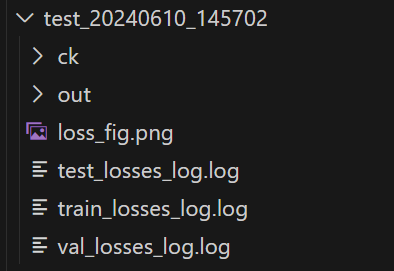
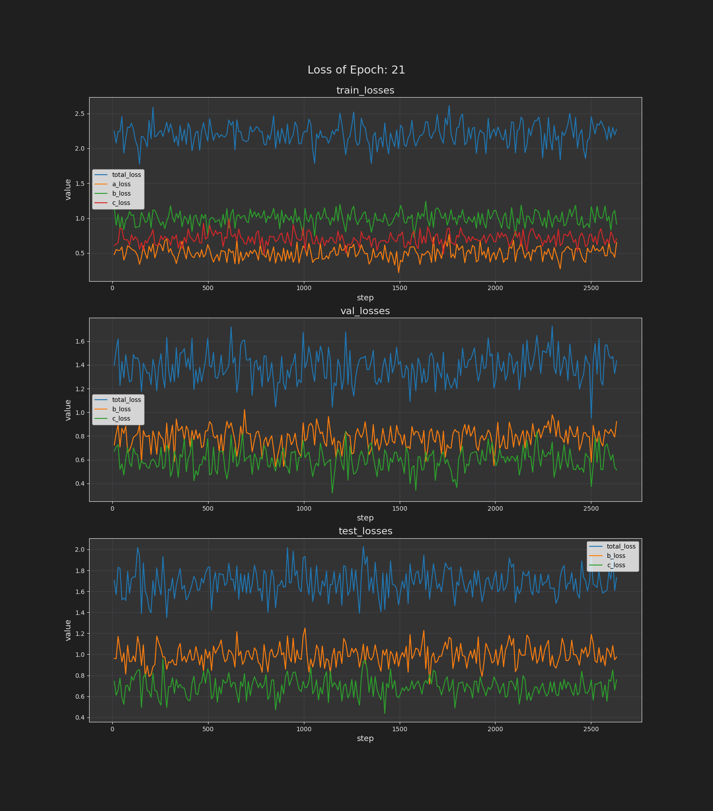
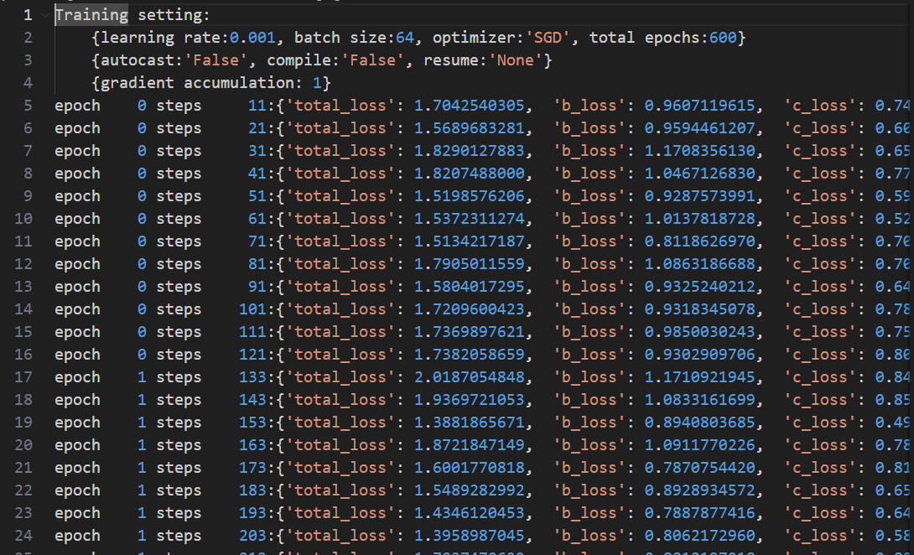

# pytorch_training_tool
## Introduction
This repo has provide a convenient and lite way to log and visualize the training process of PyTorch models. It offers several features to help users track the performance of their models during training.  

## Features
- **Automatic create Project folder**: The log files will be saved in the folder named `<My_Model>_<date>` in the current directory.  

- **Visualize the loss**: The loss of the training, validation, and testing processes will be saved in the log files.  
 
- **Loss log file**: The loss values will be saved in the log files.  
  


## Installation and Requirements
### 1. Installation
```bash
git clone https://github.com/tumeng0302/pytorch_training_tool.git
```
Clone the repository to your local directory. And copy the `log_tool.py` to your project folder.
### 2. Requirements
These are the current package of my environment. You can try using different versions of These packages.  
I would be very grateful if you could report back on their compatibility

- Python == 3.10.13
- PyTorch == 2.1.0
- tqdm == 4.62.3
- matplotlib == 3.4.3
- numpy == 1.21.2

## Documentation
### 1. Training_Log():  
Before using the functions of this repository, you need to initialize this class. For example:
```python
## usage
from log_tool import Training_Log
log = Training_Log('<My_Model>')
```
The parameter `<My_Model>` is the name of your project, which will be used to create a folder named `<My_Model>_<date>` in the current directory to store the log files.  

***input arguments***:
- `model_name`: *str*, the name of your project.
- `save_loss_fig`: *bool*, whether to save the loss figure.
- `save_weight`: *bool*, whether to save the weight of the model.
- `weight_mode`: *str*, The mode of saving the weight.
    - **'min'** for saving the weight with the minimum loss.
    - **'max'** for saving the weight with the maximum loss.
- `save_criteria`: *str*, The criteria of saving the weight.
    - **'val'** for saving the weight with the `weight_mode` of validation loss
    - **'test'** for saving the weight with the `weight_mode` of test loss,  
    - **'metric'** for saving the weight with the `weight_mode` of metric,  
    - **'train'** for saving the weight with the `weight_mode` of training loss.accuracy.
- `weight_start`: *int*, The epoch to start saving the weight.
- `step_mode`: *str*, The mode you call the step() function.
    - **'epoch'** for step in each 'epoch'.
    - **'step'** for step in each 'iteration'.  

---------------------------------------

### 2. init_loss():
This function is used to initialize the loss list. You should call this function before you push the loss into the list. For example:

```python
## usage
train_losses = ['total_loss', 'mse_loss', 'l1_loss']
test_losses = ['total_loss', 'mse_loss']
val_losses = ['total_loss', 'mse_loss']
metrics = ['mse']

log.init_loss(
    train_losses=train_losses, 
    val_losses=val_losses, 
    test_losses=test_losses, 
    metrics=metrics
)
```
***input arguments***:
- `train_losses`: *list*, The name of the training loss.
- `val_losses`: *list*, The name of the test loss.
- `test_losses`: *list*, The name of the validation loss.
- `metrics`: *list*, The name of the metric.

***Note***:
- The **'total loss'** or the **'score'** used to determine whether the model is stored should be the **'first element'** in the list.

---------------------------------------

### 3. arg_parse():
This function provides some commonly used arguments for training. You can add your own arguments to the parser.  
These are the default arguments:
| Argument | Short cut | Type | Default | Description |
|:--------:|:---------:|:----:|:-------:|:-----------:|
|       | `--gpu`         | *int*   |      0 | Set the gpu id you want to use. |
| `-B`  | `--batch`       | *int*   |     64 | Set the batch size. |
|       | `--lr`          | *float* |   1e-3 | Set the learning rate. |
| `-E`  | `--epochs`      | *int*   |    600 | Set the number of epochs. |
| `-NK` | `--num-workers` | *int*   |     12 | Set the number of workers. |
| `-PN` | `--project`     | *str*   | <date> | Set the project name. |
| `-C`  | `--compile`     | *bool*  |  False | Call this argument if you want to compile the model. |
| `-A`  | `--auto-cast`   | *bool*  |  False | Call this argument if you want to use auto-cast. |
| `-O`  | `--optimizer`   | *str*   |  'SGD' | Set the optimizer. |
| `-R`  | `--resume`      | *str*   |   None | Set the path to reload the model. |
| `-GA` | `--grad-accum`  | *int*   |      1 | Set the gradient accumulation steps, set to 1 to disable. |  

---------------------------------------  

### 4. loss.push_loss():
This function is used to push the loss into the list in every iteration. For example:  
```python
## usage
for epoch in range(epochs):
    for i, data in enumerate(train_loader):
        ...
        <Your training processes>
        loss1, loss2, loss3, loss4 = loss_func()
        ...
        log.train_loss.push_loss([
            loss1.item(),
            loss2.item(),
            loss3.item(),
            loss4.item()
        ])
```
***input arguments***:
- `losses`: *list*, The loss values you want to push into the list.  

***Note***:
- The order of the loss values should be the same as the order of the loss names you set in the `init_loss()` function.

---------------------------------------

### 5. loss.avg_loss():
This function is used to calculate the average loss of the list and will return a string for terminal log. For example:
```python
## usage
# ...
# Your training processes
# ...
loss_str = log.train_loss.avg_loss()
# print the average loss
print(loss_str) 
# or tqdm like: 
tqdm.set_postfix_str(loss_str)
```
***return***:
- `loss_str`: *str*, The average loss string. ex: 'total_loss: 0.12 | mse_loss: 0.11 | l1_loss: 0.15'  

---------------------------------------  

### 6. step():
This function is used to save the log files and the weight of the model. For example:
```python
## usage
for epoch in range(epochs):
    for i, data in enumerate(train_loader):
        ...
        <Your training processes>
        ...
    for i, data in enumerate(test_loader):
        ...
        <Your testing processes>
        ...
    log.step(result_img = result_img, net_weight = model.state_dict())
```
***input arguments***:
- `eps`: *int*, The current epoch.
- `result_img`: *Tensor*, Image of the result of the model. shape: [batch, channel, height, width]
- `net_weight`: *OrderedDict*, The state_dict of the model.
- `optimizer_state`: *OrderedDict*, The state of the optimizer.  

***Note***:
- If the `step_mode` is **'epoch'**, the epochs will be accumulated automatically.  
    If the `step_mode` is **'step'**, the epochs should be input manually for correct epoch.
- The result_img will be saved to the **./modelname/out/** folder.
- The net_weight and optimizer_state will be saved to the **./modelname/ck/** folder.  

***Here is the step mode usage:***
```python
## usage
log = Training_Log('<My_Model>', step_mode='step')
for epoch in range(epochs):
    for i, data in enumerate(train_loader):
        ...
        <Your training processes>
        ...
        if i % log_period == 0 and i != 0:
            for i, data in enumerate(test_loader):
                ...
                <Your testing processes>
                ...
            log.step(eps, save_img, model.state_dict())
```
---------------------------------------
**The complete example is in the attachment. If you have other questions about use, you can refer to `usage_example.py`**
